# Rabbit

开始

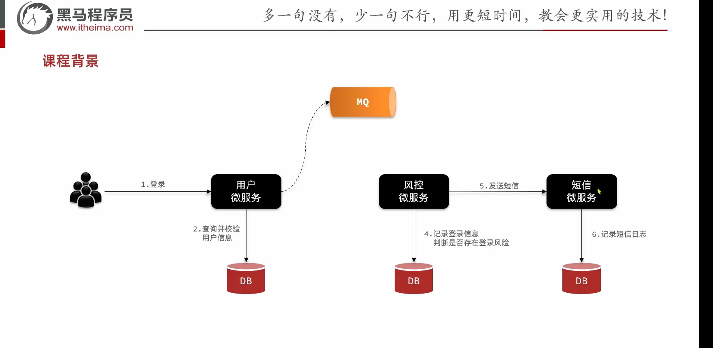


## 学习路线

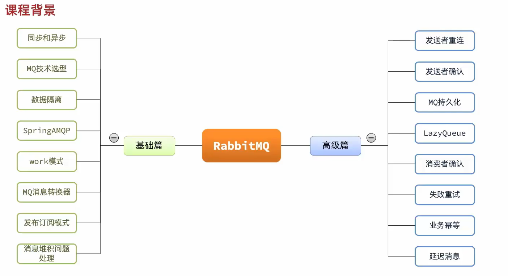

## 同步调用

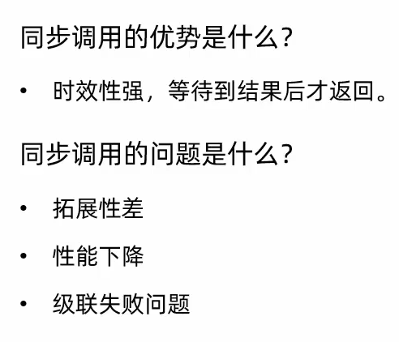

## 异步调用

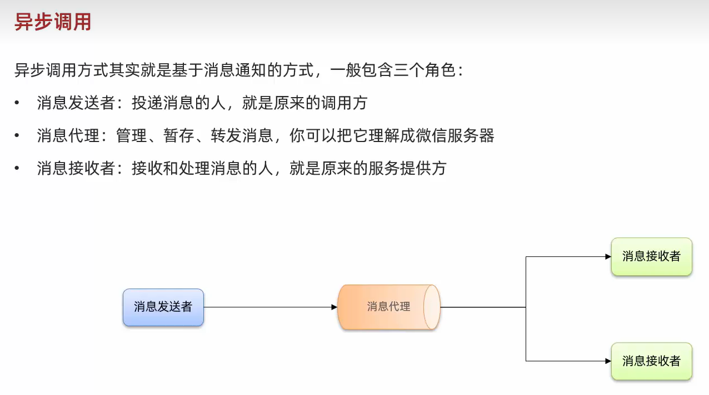

## 异步调用的优缺点

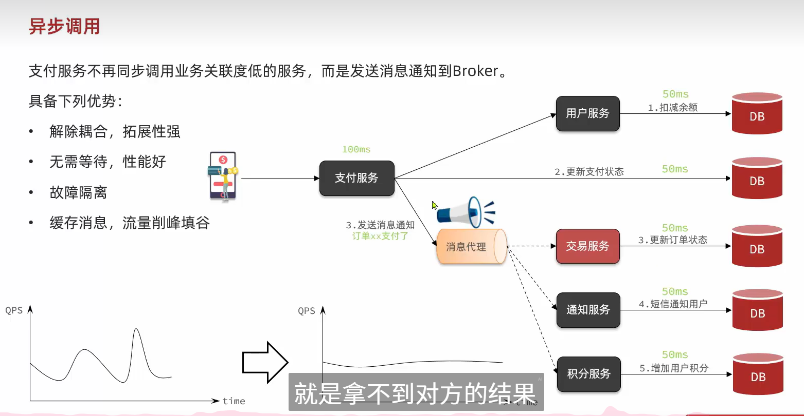


---

## 选型对比

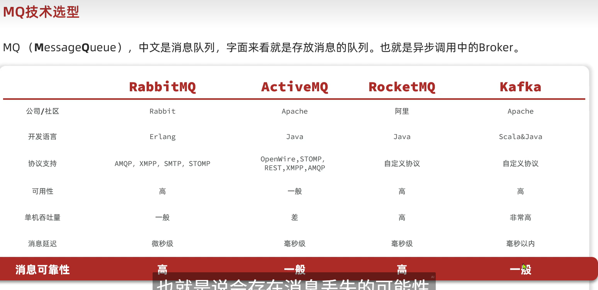

## 模型

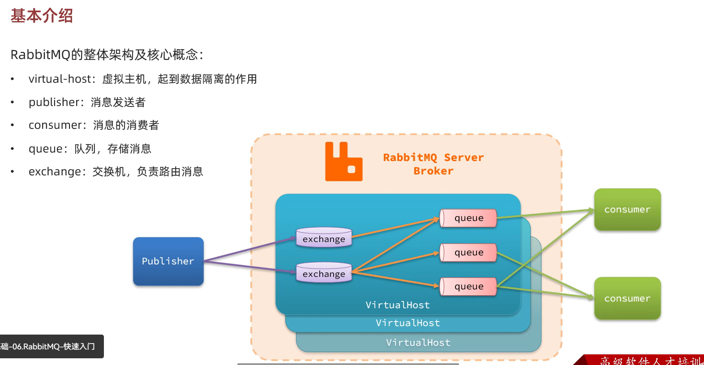


## 收发消息

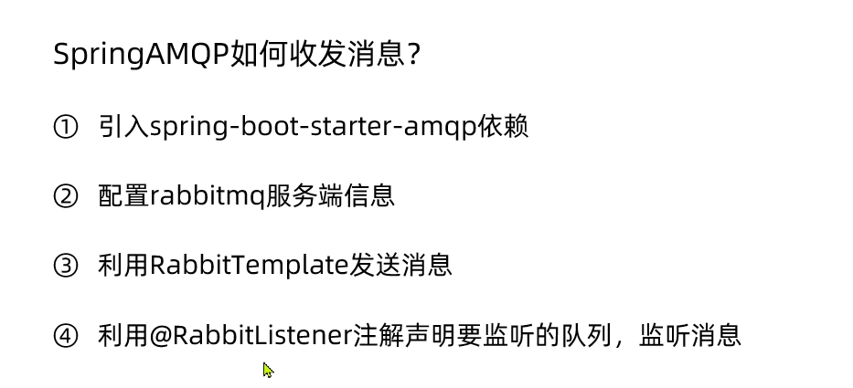

## work模型

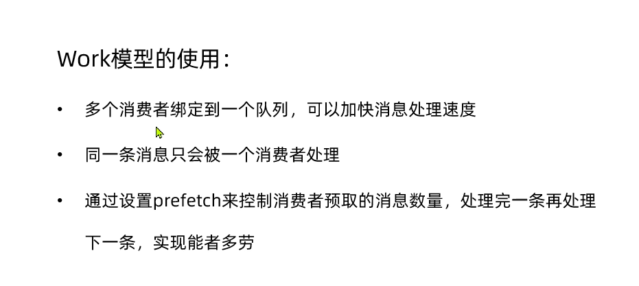

## 交换机的作用

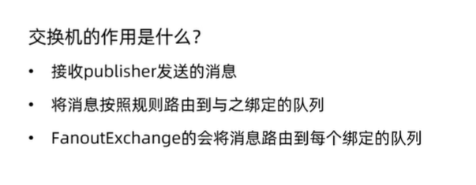

## 规则交换机

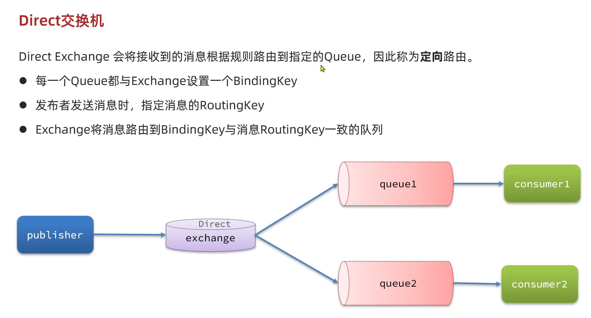


## Topic交换机

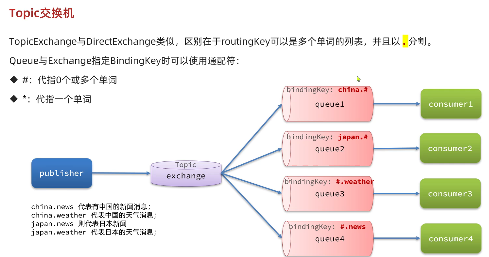

## java客户端自动创建queue的两种方式

基于注解

```java
 @RabbitListener(bindings = @QueueBinding(
            value = @Queue(name = "kumu1"),
            exchange = @Exchange(name = "suku.dircet", type = ExchangeTypes.DIRECT),
            key = {"red", "bule"}
    ))
    public void listener(String msg) {
        System.out.println("收到了一条消息" + msg + "======================");
    }
```


基于配置类

```java
package com.itheima.consumer.config;


import lombok.extern.slf4j.Slf4j;
import org.springframework.amqp.core.*;
import org.springframework.context.annotation.Bean;
import org.springframework.context.annotation.Configuration;

@Configuration
@Slf4j
public class fanoutConfig {
    @Bean
    public FanoutExchange fanoutExchange() {
//        ExchangeBuilder.fanoutExchange("suku").build();
        return new FanoutExchange("suku");
    }

    @Bean
    public Queue queueA() {
        return new Queue("ku11");
    }

    @Bean
    public Binding bindingA(Queue queueA, FanoutExchange fanoutExchange) {
        return BindingBuilder.bind(queueA).to(fanoutExchange);
    }

}
```

## 消息格式转换

```java
    @Bean
    public Jackson2JsonMessageConverter jackson2MessageConverter() {
        return new Jackson2JsonMessageConverter();
    }
```

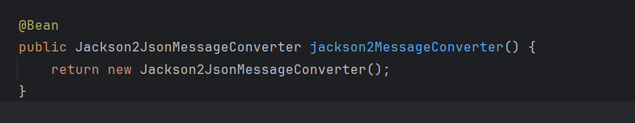