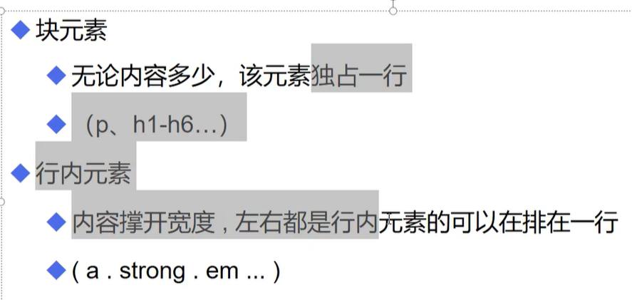
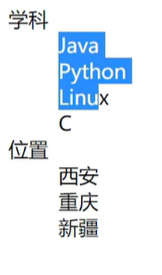
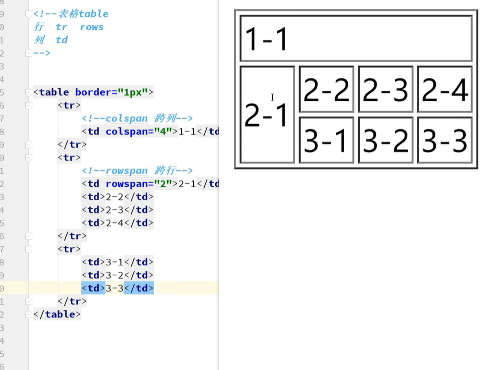
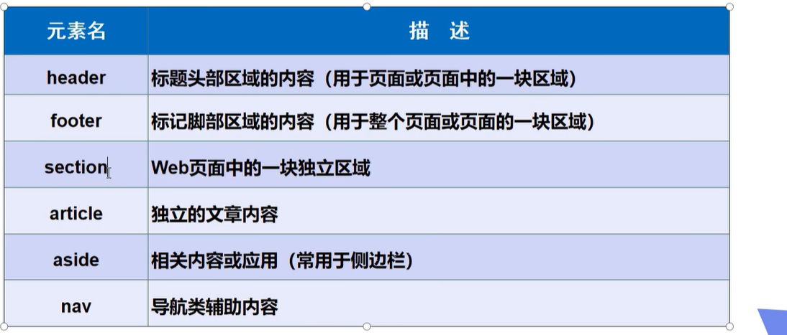
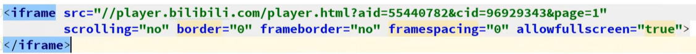
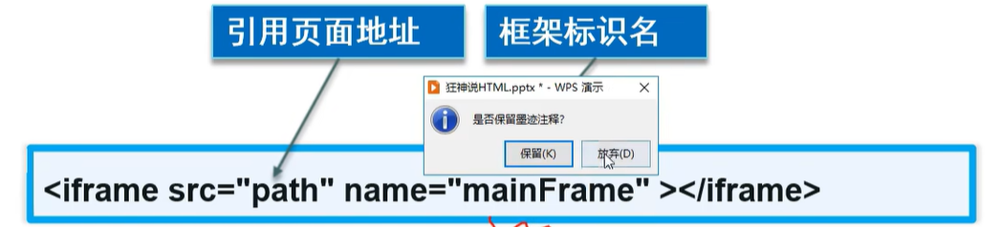
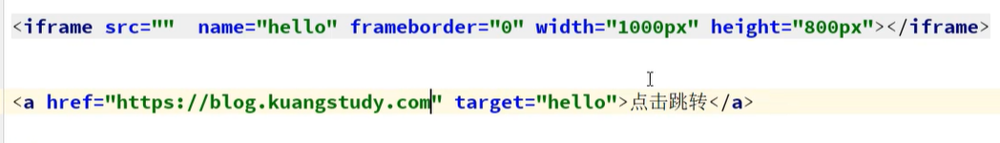
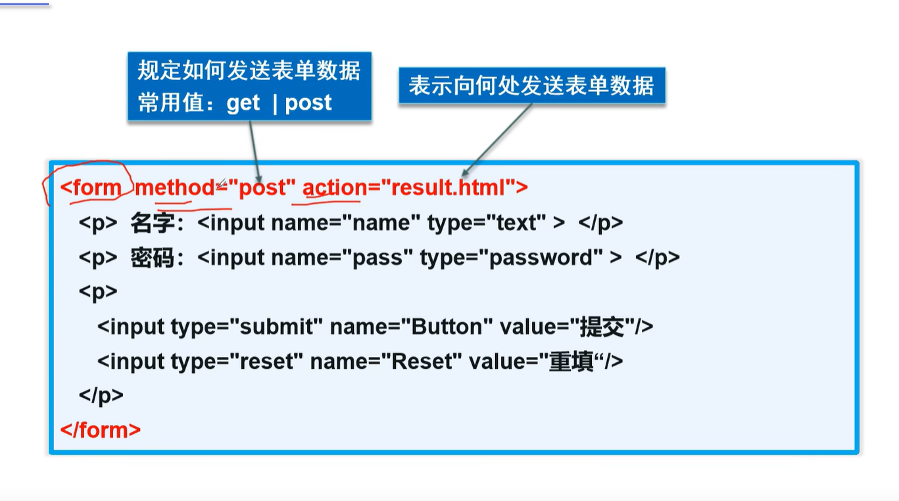
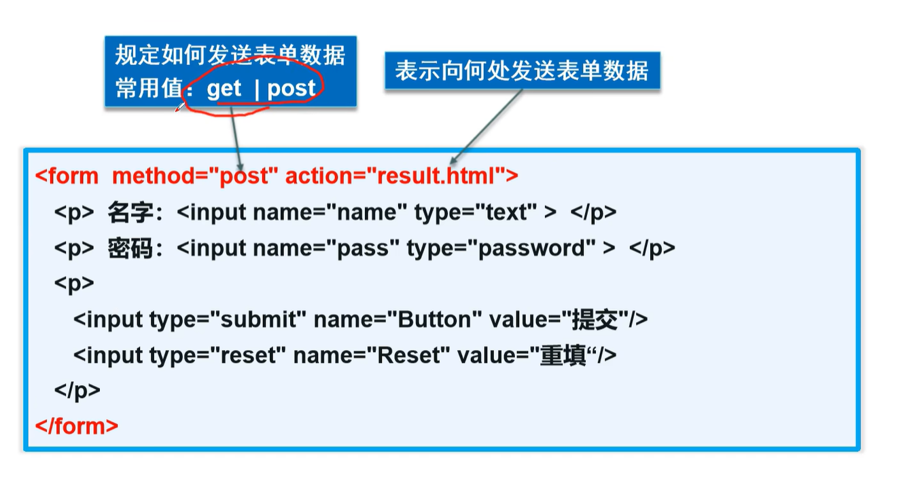
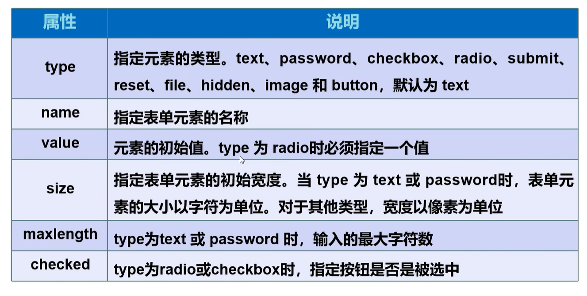

# html


### 网页基本标签

#### 标题标签

<title></title>

#### 段落标签

点击才会显示

<p></p>

#### 换行标签

<br/>

#### 水平标签

<hr>
#### 字体样式标签

<strong></strong>

<em></em>

#### 注释和特殊字符

<!---->注解

&nbsp;空格（&+nbsp;）


---

#### 图片标签

```html
      
```

../上一级地址

​	

### 链接标签

#### 文字链接

```html
<a href ="1.我的发一个网页.html" target="_blank">点击跳转到第一个页面</a>
```

_blank在新标签中打开

_self 默认在自己的网页打开


#### 图像链接

将中间的文字换成图片的链接

```html
<a href ="1.我的发一个网页.html" target="">
        
</a>
```


#### 锚链接

1.需要一个标记

2.跳转到标记

```html
<a name="top" ></a>


<a href="#top" >锚链接他会跳转到上一个链接</a>
```


#### 邮件链接

```html
<a href="mailto:3175474150@qq.com"></a>
```

​	

#### 行内标签以及块元素




### 列表

#### 有序列表

```html
<ol>
<li></li>
<li></li>
<li></li>
<li></li>
</ol> 
```

#### 无序列表

```html
 <ul>
<li></li>
<li></li>
<li></li>
<li></li>
</ul> 
```

#### 自定义列表

```html
<dl>
    <dr>学科</dr>
     <dd>java</dd>
     <dd>python</dd>
     <dd>linux</dd>
     <dd>c</dd>
     <dd>c#</dd>
</dl>
```

 

### 表格标签

表格 table

行 tr

列 td

```html
<table broder="1px">
    <tr>
        <!--跨列   colspan -->
    <td colspan="4">独占4列</td>
    <td></td>
    </tr>
    
    <tr>
        <!--跨行   rowspan -->
    <td rowspan="2"></td>
    <td></td>
    </tr>
</table>
```





### 音频与视频


#### 视频

```html
<video src=""  controls autoplay> </video>
controls 控制条
autopaly自动播放
```


#### 音频

```html
<audio src=""  controls autoplay> </audio>
```

#### 网页结构



### iframe内联框架

```html
<iframe src="" name="hello" frameborder="0" width="1000px" height="800px">
    
</iframe>

<a href ="www.baidu.com" target="hello" >点击跳转</a>
```








展示图





效果图

​	 


## form表单



#### 表单元素



#### 表单元素



```html
<from action="跳转的网页" method="请求的方式get、post">
    <p>文本框1:
        <input   name="username" type="类型" maxlength="7"最大长度为7  />
    </p>
    <inout type="radio" value="bog" name="sex">男
      <inout type="radio" value="bog" name="sex">女
          单选框
          
          
          <input type="submit" name="Button" value="提交"/>
          <input type="reset" name="Resset" value="重填"/>
</from>
```

