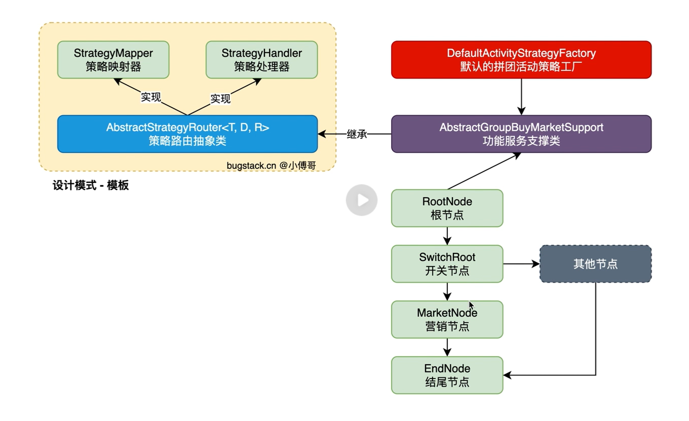
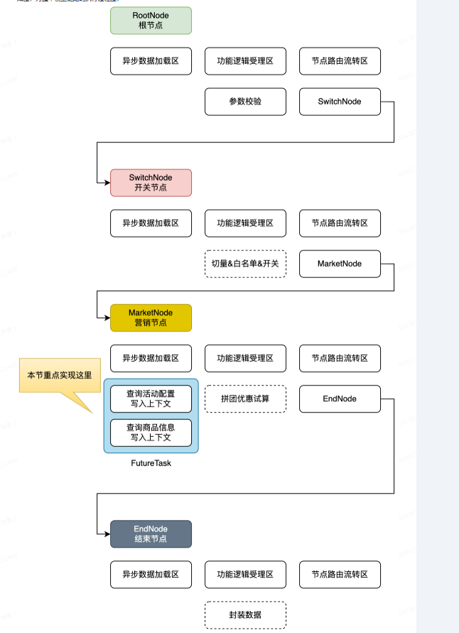
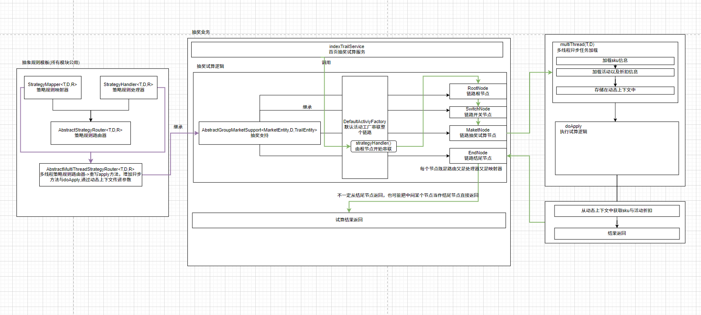
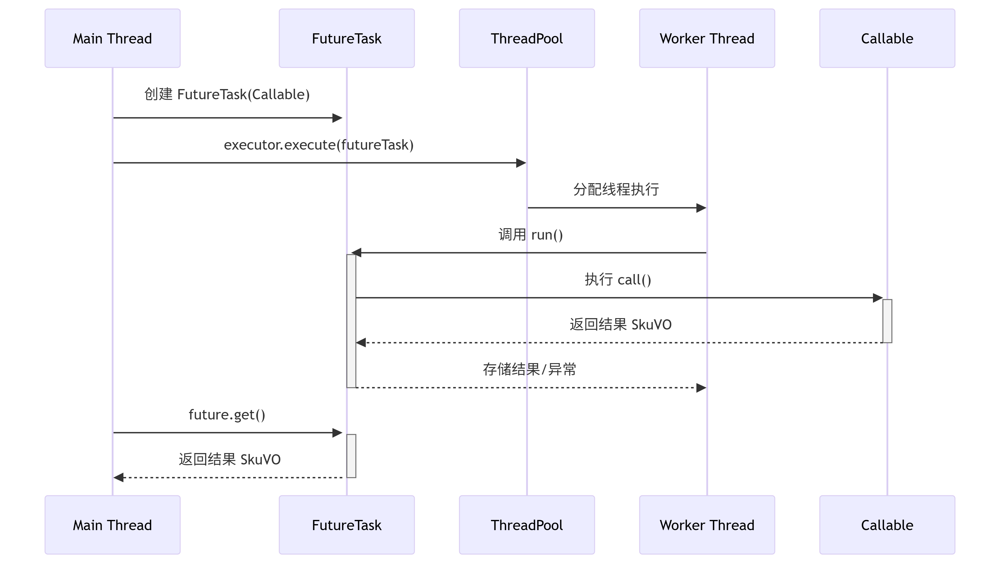
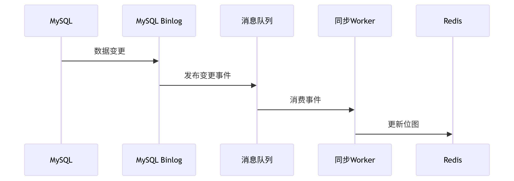
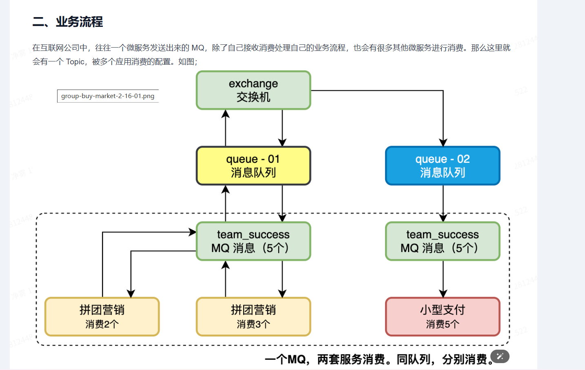
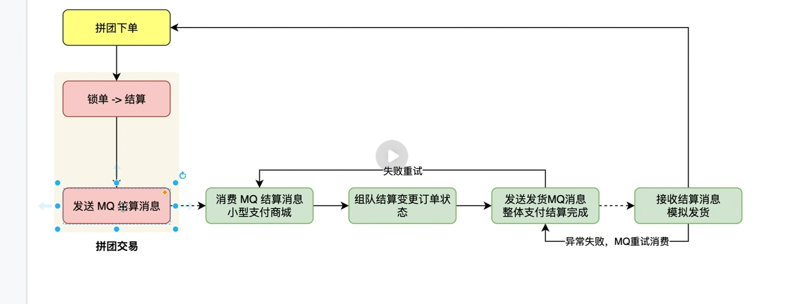
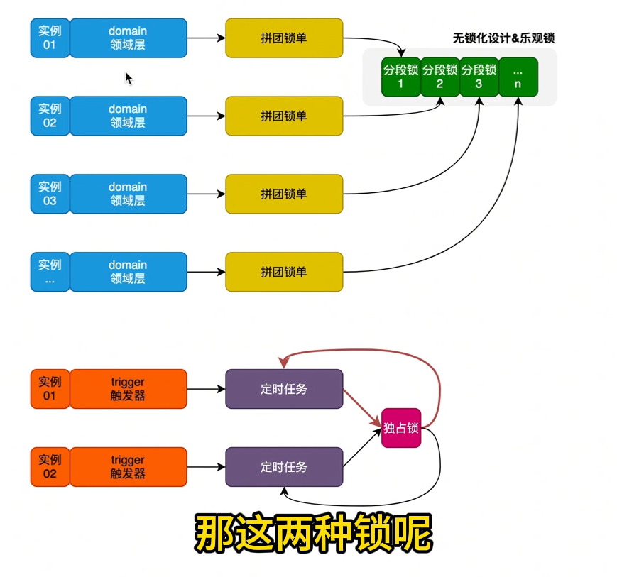

总流程


# 2-1、初始化结构


# 2-2、规则树设计



# 2-3、多线程异步数据加载





### 关于 `FutureTask<SkuVO> skuFuture = new FutureTask<>(skuTask);` 的详解

#### 1. **基本概念**

- **FutureTask** 是 Java 并发包 (`java.util.concurrent`) 中的核心类，实现了 `RunnableFuture` 接口（同时具备 `Runnable` 和 `Future` 的功能）。
- **作用**：包装异步计算任务，提供以下能力：
  - 提交给线程池执行（作为 `Runnable`）
  - 获取异步计算结果（作为 `Future`）
  - 支持取消任务和结果超时等待

------

#### 2. **代码解析**

java

```java
// 1. 创建任务实例（需实现 Callable 接口）
QuerySkuVOFromDBThreadTask skuTask = new QuerySkuVOFromDBThreadTask(...);

// 2. 用 FutureTask 包装 Callable 任务
FutureTask<SkuVO> skuFuture = new FutureTask<>(skuTask);

// 3. 提交到线程池执行
threadPoolExecutor.execute(skuFuture);

// 4. 获取结果（阻塞等待）
SkuVO result = skuFuture.get(5, TimeUnit.SECONDS); 
```

------

#### 3. **底层原理**

##### 核心流程：

图表



##### 关键设计：

1. **状态机**（`volatile int state`）：
   - NEW → COMPLETING → NORMAL（成功）
   - NEW → COMPLETING → EXCEPTIONAL（失败）
   - NEW → CANCELLED（取消）
2. **结果存储**：
   - 成功：`Object outcome` 存储结果
   - 失败：存储 `Throwable` 异常
3. **线程阻塞**：
   - 调用 `get()` 时若未完成，通过 `LockSupport.park()` 挂起线程
   - 任务完成后用 `LockSupport.unpark()` 唤醒等待线程

------

#### 4. **使用场景**

| **场景**           | **说明**                                        |
| :----------------- | :---------------------------------------------- |
| 并行计算           | 同时执行多个耗时任务（如IO/计算），最后合并结果 |
| 超时控制           | `get(timeout, unit)` 避免无限等待               |
| 任务取消           | `cancel(true)` 中断正在执行的任务               |
| 异步回调（需扩展） | 配合 `CompletableFuture` 实现链式调用（Java8+） |

------

#### 5. **关键注意事项**

1. **任务只执行一次**：

   - `FutureTask` 不可重复使用（状态变迁后不可重置）

   java

   ```
   // 错误示例：重复提交同一个 FutureTask
   executor.execute(future); // 第一次执行
   executor.execute(future); // 抛出异常！
   ```

2. **结果获取阻塞**：

   - `get()` 会阻塞线程直到任务完成（建议使用带超时的版本）

3. **异常处理**：

   - 任务中的异常会被包装在 `ExecutionException` 中

   java

   ```
   try {
       result = future.get();
   } catch (ExecutionException e) {
       Throwable cause = e.getCause(); // 获取原始异常
   }
   ```

4. **资源释放**：

   - 取消未开始的任务：`future.cancel(false)`
   - 中断运行中的任务：`future.cancel(true)`

------

#### 6. **替代方案（Java8+）**

java

```
// 使用 CompletableFuture（推荐）
CompletableFuture<SkuVO> future = CompletableFuture.supplyAsync(() -> {
    // 业务逻辑
    return skuService.getSku(id);
}, threadPoolExecutor);

// 链式处理
future.thenApply(sku -> convert(sku))
      .exceptionally(ex -> handleError(ex));
```

------

#### 7. **最佳实践建议**

1. **线程池隔离**：

   - 为不同类型任务创建独立线程池（避免相互影响）

   java

   ```
   // 建议：不同业务使用不同线程池
   ExecutorService dbQueryPool = Executors.newFixedThreadPool(5);
   ExecutorService calcPool = Executors.newFixedThreadPool(3);
   ```

2. **防御性超时**：

   java

   ```
   // 强制设置超时（避免系统雪崩）
   future.get(500, TimeUnit.MILLISECONDS);
   ```

3. **结合 Spring 异步注解**：

   java

   ```
   @Async("customExecutor")
   public Future<SkuVO> querySkuAsync(Long skuId) {
       // ...
   }
   ```

4. **监控任务状态**：

   java

   ```
   if (!future.isDone()) {
       log.warn("任务仍在运行");
   }
   ```

> **提示**：在分布式/高并发场景下，建议使用更高级的工具（如RxJava、Reactor），但 `FutureTask` 仍是理解Java异步编程的基础。

# 2-4、通过策略模式来对优惠试算进行处理

共有四种优惠策略

MJ

N

ZJ

ZK

# 2-5、将人群数据写入到 Redis BitMap

# 2-6、拆分库表关联关系

# 2-7、用人群标签区分能不能参与活动以及活动的可见性

先判断tag_id人群

在判断范围

即先判断是否有人群要求，有就判断是否有范围，没有直接放行

获取活动的可见性以及是否可以参与

出现了问题：

数据库的数据更改不能同步带redis，redis查到的还是老数据

修复方法1：

#### 实时双写（推荐）

在更新mysql后就更新redis

#### 定时同步（补偿机制）

设定定时任务

```java
// 定时同步任务
@Scheduled(cron = "0 0/30 * * * ?") // 每30分钟
public void syncTagData() {
    List<String> activeTags = tagRepository.getActiveTags();
    
    for (String tagId : activeTags) {
        List<String> userIds = tagRepository.getTagUsers(tagId);
        RBitSet bitSet = redisService.getBitSet(tagId);
        
        // 重建位图
        bitSet.delete();
        userIds.forEach(userId -> 
            bitSet.set(redisService.getIndexFromUserId(userId), true)
        );
    }
```

#### 事件驱动（最优雅）



Debezium 捕获 MySQL binlog

Kafka/RocketMQ 传输事件

自定义 Worker 处理同步

# 2-8、动态配置开关操作

**步骤1；添加一个自定义注解，用于 Spring 扫描 Bean 对象的时候，可以直接管理这些配置了自定义注解的类的属性。**

**步骤2；给服务类的属性添加自定义注解。**

**步骤3；由 app 模块下的 config，添加一个动态配置管理的工厂🏭，会自动的完成属性信息的填充和动态变更操作。**

**步骤4；业务使用，会调用步骤2中的属性服务。当有配置操作变动的时候，则可以把配置信息直接刷新到内存属性上。**

**步骤5；配置的变更来自于这里，当调用 DCCController 时，会触发 Redis 的发布/订阅，动态值的变更，以此把类上的属性的值做变更。**


五、读者作业

简单作业：理解关于动态配置的使用和实现方案，完成本节代码实现。

复杂作业：增加一个白名单用户的动态配置验证。

# 2-9、拼团交易营销锁单

当商城类系统接入拼团时，则需要在下单过程中使用一笔营销优惠。这里的营销优惠可以为；无券平台营销、有券消费营销、拼团折扣营销、积分抵扣营销等。

那么，当商城类系统接入使用下单时，则需要到拼团系统锁定一笔优惠，也就是占用一个名额。完事后，商城类系统继续操作支付交易的过程。


# 2-10责任链抽象模板设计

# 2-11完善拼单流程

# 2-12拼团组队结算统计

# 2-13交易结算责任链过滤

# 2-14拼团回调通知任务


# 3-1设计页面暂停======开始学习小型支付商城


# 2-15 对接接口

```sql
    <select id="queryInProgressUserGroupBuyOrderDetailListByActivityId" parameterType="java.lang.Long"
            resultMap="dataMap">
        select ANY_VALUE(user_id) AS user_id,  -- 使用MySQL专有函数
               team_id,
               ANY_VALUE(out_trade_no) AS out_trade_no
        from group_buy_order_list
        where activity_id = #{activityId} and status in (0, 1)
        group by team_id
    </select>
```

因为 select 里面有三个参数，只按照一个排序，

1. **业务逻辑缺陷**：
   
   - 当按 `team_id` 分组时，一个团队可能对应多个 `user_id` 和 `out_trade_no`
   
   - MySQL 无法确定该返回哪条记录，因此拒绝执行
   
     
   
     
   
     
   
     大飒飒
   

# 

# 2-16mq消息



# 2-18消费mq结算



# 2-19独占锁以及无锁化



使用了分段锁来对redis来对

```
   String lockKey = teamStockKey + Constants.UNDERLINE + occupy;
        Boolean lock = redisService.setNx(lockKey, validTime + 60, TimeUnit.MINUTES);
        if (!lock) {
```

# 2-25退单分析

### 逆向流程


### 退单UML图


# 3-7用户订单列表和退单ui

```java
   List<PayOrder> queryUserOrderList(@Param("userId") String userId, @Param("lastId") Long lastId, @Param("pageSize") Integer pageSize);

    PayOrder queryOrderByUserIdAndOrderId(@Param("userId") String userId, @Param("orderId") String orderId);

    boolean refundOrder(@Param("userId") String userId, @Param("orderId") String orderId);
```

==**当 MyBatis 的接口方法有多个参数时，`@Param` 注解是必须的。它用于为每个参数定义一个明确的名称，以便在 XML 映射文件中引用。**==
