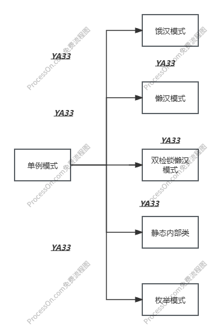
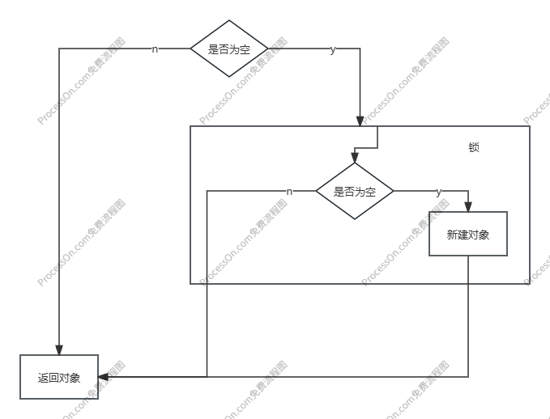

`以下是修改文章的一些准则，你将基于他修改文章`

`1.完善我提供的文章,我需要在dscn上发布`

`3.扩展文章，使文章结构连贯，逻辑自然，添加必要描述，以及标题`

`4.如果遇见不明白的问题需要向我提问，有错误的地方需要指出并修正`

`5.添加代码时可以添加特征我的用户名为YA33`

`6.在文章原本的基础上进行扩展，包括深度与广度`

`7.如果是纯文字内容可以添加图解，举例子等方便理解，并添加必要的思维导图`

`8.采用正常人的口吻`

`9.按点区分，标题不要使用特殊符号`

`10.需要markdown格式的文件，对各级标题进行划分`

`11.添加注解代码使用java语言`


---

---

---


 单例模式

`只创建一个对一个对象OR每次使用的对象都是同一个对象`


构建的原则：

+ 私有构造（防止类被通过常规的方法实例化）
+ 以静态方法或者枚举类返回实例（保证实例的唯一性）
+ 确保实例只有一个，尤其是在多线程的环境。（保证在创建实例时的线程安全）
+ 确保反序列化时不会重复的构建对象。（在序列化/反序列化的场景下单列被莫名破坏，造成为考虑的后果）


创建的方式：

主动处理：

1. synchronized
2. volatitle
3. cas

jvm机制：

1. 由静态初始化器（在静态字段上或者static{}块中的初始化器）初始化数据时
2. 访问final字段时
3. 在创建线程之前创建对象时
4. 线程可以看见它将要处理的对象时


单例模式的分类： 




+ 静态内部类

```java
public class Singleton_1 {
    public static ArrayList<String>  list=new ArrayList<>();
    /**
     * 在jvm初始化的时候就会加载进来
     * 常用于保存全局对象
     * */
}
```

+ 饿汉模式

```java
public class Singleton_2 {
    private static Singleton_2 initS =new Singleton_2();
    //私有化构造方法，不对外提供
    private Singleton_2(){}
    //返回已经创建好的对象
    public static Singleton_2 getSingleton(){
        return initS;
    }
    /**
    *在应用启动的时候就创建对象
     * 类似于一个很饿的，上来就要吃饭
     * * */
}
```

+ 懒汉模式

  ```java
  public class Singleton_3 {
      private static  Singleton_3 initS;
      private Singleton_3(){}
      public  static Singleton_3 getInitS(){
          if (null!=initS){
              return initS;
          }
          return new Singleton_3();
      }
      /**
       * 只有当对象不存在的时候才会去创建，存在就不创建了
       * 就像一个吃饱饭的人，只有饿了才会去备注吃饭
       * 但是如果有多个人同时来创建的话可能会同时创建多个
       * 所以他说线程不安全的
       * */
  }
  ```

+ 双检锁的懒汉模式

```java
public class Singleton_4 {
    private static volatile Singleton_4 initS;
   //保证可见性,轻量级的同步机制
   //防止指令重排，即指向堆内存空间的时候未初始化
    /**
    * 1、在堆中开辟空间
    * 2、实例化各种参数
    * 3、将对象的指针指向堆内存的空间
    */
    private Singleton_4() {
    }
    public Singleton_4 getInitS() {
        if (initS == null) {
            synchronized (Singleton_4.class) {
                if (initS == null) {
                    return new Singleton_4();
                }
            }
        }
        return initS;
    }
}
```



内部类的模式

```java
public class Singleton_5 {
    private static class inits {
        private static Singleton_5 initS = new Singleton_5();
    }

    private Singleton_5() {
    }

    public static Singleton_5 getInstance() {
        return inits.initS;
    }
}
```

+ 不需要加锁，可以保证现在安全，延迟加载就是不能传参

cas:

```java
public class Singleton_6 {
    private static final AtomicReference<Singleton_6> INITS = new AtomicReference<Singleton_6>();
    private static Singleton_6 initS;

    private Singleton_6() {
    }
    public static final Singleton_6 getInstance() {
        for (; ; ) {
            Singleton_6 initS = INITS.get();
            if (null != initS) return initS;
            INITS.compareAndSet(null, new Singleton_6());
            return INITS.get();
        }
    }
}
```

这部分需要添加解释

枚举：

```java
public enum Singleton_7 {
    INITS;
    public  void test(){
        System.out.println("hello word");
    }
}
```

这部分需要添加解释

---

---

# 单例模式详解：从原理到多种实现方式

## 什么是单例模式

单例模式是一种常用的软件设计模式，它的核心思想是确保一个类只有一个实例，并且提供一个全局访问点来获取这个实例。简单来说，就是“只创建一个对象，或者每次使用的对象都是同一个对象”。

这种模式在许多场景下非常有用，比如配置信息管理、线程池、数据库连接池、日志对象等，这些情况下我们需要确保全局只有一个实例存在，以避免资源浪费或状态不一致的问题。

## 单例模式的构建原则

要实现一个正确的单例模式，需要遵循以下几个重要原则：

1. **私有构造方法** - 防止类被通过常规的方法实例化，确保只能通过特定方式创建实例
2. **以静态方法或枚举返回实例** - 提供统一的访问点，保证实例的唯一性
3. **确保多线程环境下的安全** - 特别是在创建实例时需要保证线程安全
4. **防止反序列化破坏单例** - 在序列化/反序列化场景下，确保不会重复构建对象

## 单例模式的创建方式

### 主动处理方式
1. **synchronized关键字** - 通过同步机制保证线程安全
2. **volatile关键字** - 保证变量的可见性和防止指令重排序
3. **CAS(Compare And Swap)** - 通过原子操作实现无锁线程安全

### JVM机制保障
1. **静态初始化器** - 在静态字段或static{}块中的初始化器初始化数据时
2. **final字段访问** - 访问final字段时的特殊处理
3. **线程创建前对象创建** - 在创建线程之前创建对象
4. **对象可见性** - 线程可以看见它将要处理的对象

## 单例模式的分类与实现

下面是单例模式的主要分类示意图：


### 1. 静态常量方式（饿汉式）

```java
public class Singleton_1 {
    public static ArrayList<String> list = new ArrayList<>();
    
    /**
     * 在JVM初始化的时候就会加载静态变量
     * 常用于保存全局配置或共享数据
     * 由YA33编写
     */
}
```

**特点**：
- 类加载时就完成初始化，避免了线程同步问题
- 没有达到懒加载的效果，如果从未使用过这个实例，会造成内存浪费

### 2. 饿汉模式

```java
public class Singleton_2 {
    // 在类加载时就创建实例
    private static Singleton_2 instance = new Singleton_2();
    
    // 私有化构造方法，不对外提供
    private Singleton_2() {
        // 初始化代码
    }
    
    // 返回已经创建好的对象
    public static Singleton_2 getInstance() {
        return instance;
    }
    
    /**
     * 在应用启动的时候就创建对象
     * 类似于一个很饿的人，上来就要吃饭
     * 由YA33编写
     */
}
```

**优缺点分析**：
- 优点：写法简单，类加载时就完成实例化，避免了线程同步问题
- 缺点：没有达到懒加载的效果，如果从始至终从未使用过这个实例，则会造成内存的浪费

### 3. 懒汉模式（基础版）

```java
public class Singleton_3 {
    private static Singleton_3 instance;
    
    private Singleton_3() {
        // 初始化代码
    }
    
    public static Singleton_3 getInstance() {
        if (instance == null) {
            instance = new Singleton_3();
        }
        return instance;
    }
    
    /**
     * 只有当对象不存在的时候才会去创建，存在就不创建了
     * 就像一个吃饱饭的人，只有饿了才会去备饭
     * 但是如果有多个人同时来创建的话可能会同时创建多个
     * 所以它是线程不安全的
     * 由YA33编写
     */
}
```

**线程安全问题说明**：
在多线程环境下，如果两个线程同时判断`instance == null`，可能会创建两个实例，违反了单例原则。

### 4. 双检锁懒汉模式（DCL）

```java
public class Singleton_4 {
    // 使用volatile保证可见性和防止指令重排
    private static volatile Singleton_4 instance;
    
    private Singleton_4() {
        // 初始化代码
    }
    
    public static Singleton_4 getInstance() {
        if (instance == null) { // 第一次检查
            synchronized (Singleton_4.class) { // 加锁
                if (instance == null) { // 第二次检查
                    instance = new Singleton_4();
                }
            }
        }
        return instance;
    }
    
    /**
     * 双检锁模式既实现了延迟加载，又保证了线程安全
     * 同时减少了同步代码块的使用，提高了效率
     * 由YA33编写
     */
}
```

**为什么要使用volatile？**
对象的创建过程分为三步：
1. 在堆中开辟空间
2. 实例化各种参数
3. 将对象的指针指向堆内存的空间

如果没有volatile，可能会发生指令重排，导致其他线程获取到未完全初始化的实例。

双检锁机制的执行流程如下：


### 5. 静态内部类方式

```java
public class Singleton_5 {
    // 私有构造函数
    private Singleton_5() {
        // 初始化代码
    }
    
    // 静态内部类
    private static class SingletonHolder {
        private static final Singleton_5 INSTANCE = new Singleton_5();
    }
    
    // 获取实例
    public static Singleton_5 getInstance() {
        return SingletonHolder.INSTANCE;
    }
    
    /**
     * 不需要加锁，可以保证线程安全，实现了延迟加载
     * 由JVM保证线程安全性，在类进行初始化时，其他线程无法进入
     * 缺点是不能传递参数
     * 由YA33编写
     */
}
```

**工作原理**：
静态内部类不会在外部类加载时立即加载，而是在调用getInstance()方法时才会加载SingletonHolder类并初始化INSTANCE，这既实现了懒加载，又由JVM保证了线程安全。

### 6. CAS方式实现

```java
import java.util.concurrent.atomic.AtomicReference;

public class Singleton_6 {
    private static final AtomicReference<Singleton_6> INSTANCE = new AtomicReference<>();
    
    private Singleton_6() {
        // 初始化代码
    }
    
    public static Singleton_6 getInstance() {
        for (;;) {
            Singleton_6 current = INSTANCE.get();
            if (current != null) {
                return current;
            }
            current = new Singleton_6();
            if (INSTANCE.compareAndSet(null, current)) {
                return current;
            }
        }
    }
    
    /**
     * 使用CAS(Compare And Swap)原子操作实现无锁线程安全
     * 适合高并发场景，避免了锁的开销
     * 但在竞争激烈的情况下可能会多次创建实例(但最终只会有一个成功)
     * 由YA33编写
     */
}
```

**CAS原理说明**：
CAS是一种无锁算法，它包含三个操作数：内存位置(V)、预期原值(A)和新值(B)。如果内存位置的值与预期原值相匹配，处理器会自动将该位置值更新为新值，否则不做操作。

### 7. 枚举方式

```java
public enum Singleton_7 {
    INSTANCE;
    
    // 可以添加任意方法
    public void doSomething() {
        System.out.println("Hello World");
    }
    
    /**
     * 枚举方式实现单例是《Effective Java》作者Joshua Bloch推荐的方式
     * 它不仅能避免多线程同步问题，还能防止反序列化重新创建新的对象
     * 绝对防止多次实例化，是更简洁、安全的单例实现方式
     * 由YA33编写
     */
}
```

**枚举单例的优势**：
1. 写法简单
2. 线程安全有保障
3. 防止反序列化破坏单例
4. 防止反射攻击

## 如何选择单例实现方式

根据不同的场景，可以选择合适的单例实现方式：

| 实现方式     | 线程安全 | 懒加载 | 性能 | 防序列化破坏 | 适用场景                     |
| ------------ | -------- | ------ | ---- | ------------ | ---------------------------- |
| 饿汉式       | 是       | 否     | 高   | 否           | 简单应用，实例小且一定会用到 |
| 懒汉式(同步) | 是       | 是     | 低   | 否           | 不推荐使用                   |
| 双检锁       | 是       | 是     | 中   | 否           | 需要懒加载且对性能有一定要求 |
| 静态内部类   | 是       | 是     | 高   | 否           | 需要懒加载且实现简单         |
| 枚举         | 是       | 否     | 高   | 是           | 最佳实践，推荐使用           |
| CAS          | 是       | 是     | 不定 | 否           | 高并发场景，避免锁竞争       |

## 总结

单例模式是设计模式中最简单但也是最常被问到的模式之一。正确实现单例模式需要考虑线程安全、懒加载、序列化等问题。在实际开发中，推荐优先使用枚举方式实现单例，因为它简洁、安全且功能完整。如果需要有懒加载效果，静态内部类方式是一个不错的选择。在特别高并发的场景下，可以考虑使用CAS方式避免锁竞争。

无论选择哪种方式，都应该根据具体业务场景和需求来决定，确保在满足功能需求的同时，保证代码的性能和可维护性。

---
*本文由YA33整理编写，旨在帮助开发者深入理解单例模式的原理与实现。如有疑问或建议，欢迎交流讨论。*
