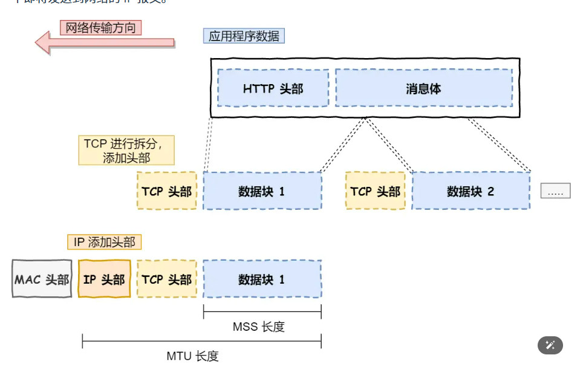
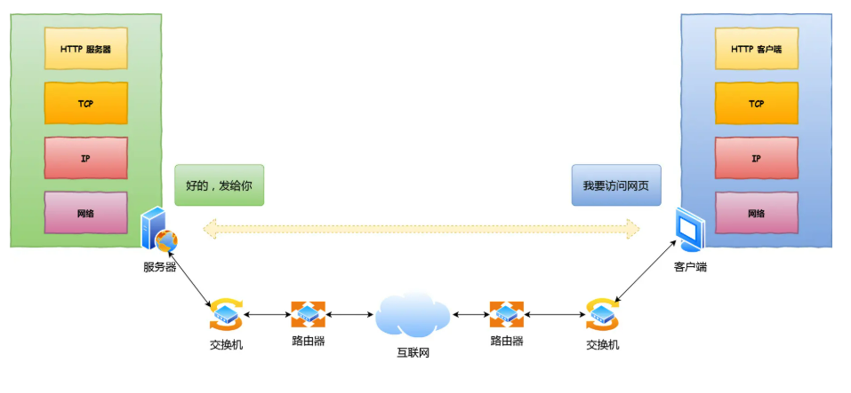
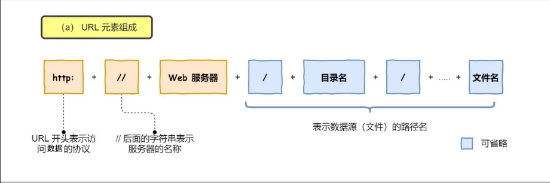
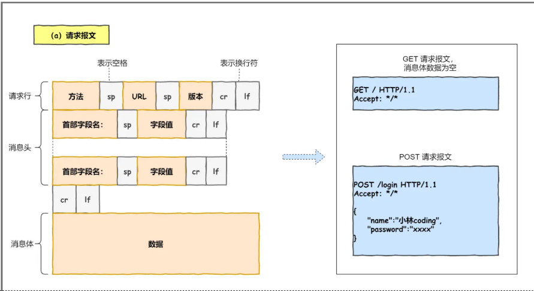
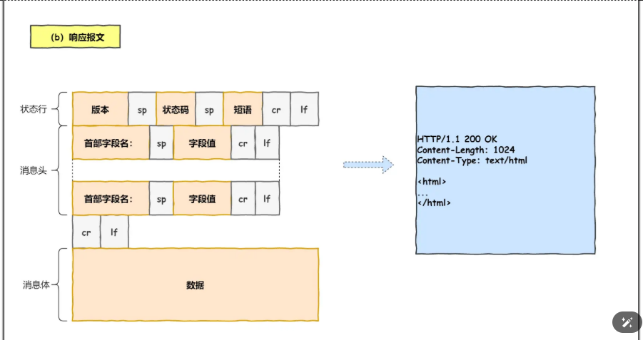
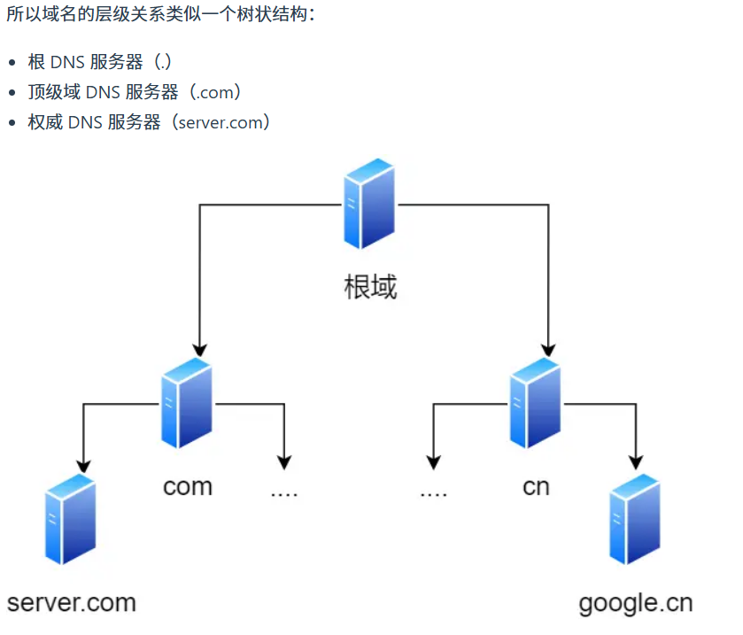
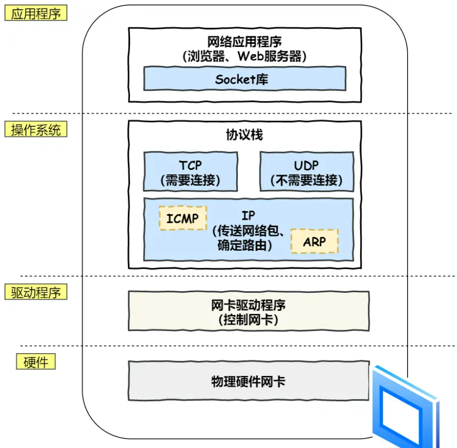

# 1.TCP/IP网络模型有几层

## 应用层

应用直接把数据传输给下一层，应用只需要专注为为用户提供对用的功能比如http、https、ftp、dns

（相当于我们寄快递的时候直接把快递交给邮递员）

## 传输层

在传输层有两个协议，一个是tcp一个是udp

tcp相比于udp多了很多对应的特性

流量控制、超时重传、阻塞控制

udp就是直接发送数据包（广播）

## 网络层

真正执行传输的一层

使用的是ip协议

ip报文、头部

****

## 网络接口层

在ip报文生成后对应的交给网络接口层添加对应mac头部，并封装为数据帧发送至互联网

# 访问百度网页期发什么了什么？

总览：

## 解析url

+ 协议
+ 请求的地址，
+ 接口或者文件（资源）

如果没写请求文件就会请求默认的界面

​	

+ 拿到对应的请求协议以及对应的地址、资源就可以组装一个http请求

+ 请求报文：

+ 响应报文

# DNS解析

因为一般拿到的是域名，将域名转换为对应的ip地址

www.baid.com

域名是这样，其实末尾还有一个点，即真实的域名为

www.baidu.com.

越往右等级越高，即

+ `.`根域在最顶层
+ `com`顶级域
+ 下面依次类推

解析拿到ip后，会传到http协议栈

+ 把这些做完后，就可以发送网络包

tcp报文格式
