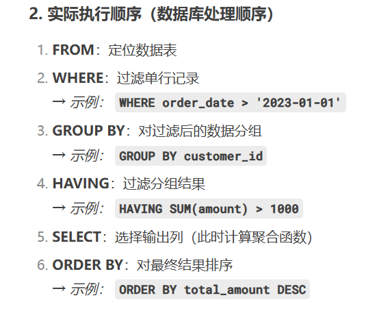
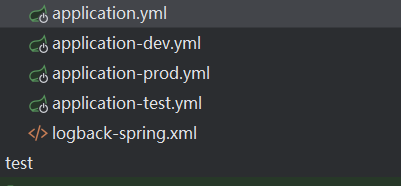
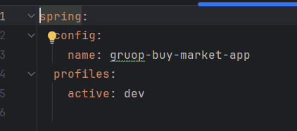

# 8.11中科全安

---

---

#### 1、git什么时候会出现报错

==当两个人同时修改了一个文件并且提交到远程时==

#### 2. Controller 层的注解（考察前后端数据转换）

==常用注解及作用：==

| 注解              | 作用                                                         |
| :---------------- | :----------------------------------------------------------- |
| `@RestController` | 组合注解，包含 `@Controller` + `@ResponseBody`，直接返回 JSON 数据。 |
| `@RequestBody`    | **将前端 JSON 请求体转换为 Java 对象**（如 `User user`）。   |
| `@ResponseBody`   | 将方法返回值转为 JSON 响应（通常由 `@RestController` 自动处理）。 |
| `@RequestParam`   | 获取 URL 查询参数（如 `?name=Alice`），支持基本类型/字符串。 |
| `@PathVariable`   | 获取 URL 路径参数（如 `/user/{id}`）。                       |
| `@GetMapping`     | 限定 HTTP GET 请求。                                         |
| `@PostMapping`    | 限定 HTTP POST 请求。                                        |

#### 3、前端传递的list，后端怎么接

**场景**：前端通过 `GET` 或 `POST` 传递数组（如 `[1, 2, 3]`）。


==前端传递过来的就是数组，后端可以直接接收==

#### 4、启动jar包的命令

java  -jar 文件名

#### 5、是否上线部署过

无，待补充

#### 6、策略模式的好处

1. **解耦**：将算法/策略与业务逻辑分离，避免 if-else 嵌套。
2. **扩展性**：新增策略时只需添加新类，无需修改原有代码（符合开闭原则）。
3. **复用性**：策略可被多个上下文复用。
4. **可维护性**：每个策略独立管理，逻辑清晰。

#### 7、在哪里使用了线程池

在营销节点部分，当进入营销节点的时候，就会开启异步线程，加载商品的数据

#### 8、jwt有哪几部分

头部、载荷、签名

#### 9、线程池的拒绝策略

| 策略                  | 行为                                       |
| :-------------------- | :----------------------------------------- |
| `AbortPolicy`（默认） | 抛出 `RejectedExecutionException` 异常。   |
| `CallerRunsPolicy`    | 由提交任务的线程直接执行该任务。           |
| `DiscardPolicy`       | 静默丢弃新任务，不抛异常。                 |
| `DiscardOldestPolicy` | 丢弃队列中最旧的任务，重新尝试提交新任务。 |

#### 10、docker都用来干嘛了、安装在linux还是windows上


#### 11、前端传过来的对象，后端怎么接受

**核心方法**：使用 `@RequestBody` 注解
**场景**：前端通过 POST/PUT 请求发送 JSON 对象（如 `{"name":"张三","age":25}`）

#### 12、使用什么测试接口

jemter、apifox

#### 13、项目有前端页面吗？

没有


#### 14、nginx怎么实现反向代理

**反向代理**：客户端访问代理服务器（Nginx），代理服务器将请求转发到内部的后端服务器（如Tomcat、Node.js等），并将结果返回给客户端。客户端不知道真实的后端服务器地址。

可以在配置文件里面配置相对应的请求转发地址


---

---

# 万声

MyBatis-Plus 是一个 MyBatis 的增强工具，它通过内置的通用 CRUD 操作和强大的条件构造器，**实现了单表操作无需编写 SQL**。以下是详细说明和示例：

### **核心原理：**

1. **继承内置 `BaseMapper` 接口**
   开发者只需让自定义的 Mapper 接口继承 `BaseMapper<T>`，即可获得大量预置的 CRUD 方法。
2. **动态 SQL 生成**
   MyBatis-Plus 在运行时根据实体类信息（如表名、字段名）和调用方法自动生成 SQL。
3. **条件构造器 `Wrapper`**
   通过链式调用构建查询条件（如 `eq()`, `like()`），替代手写 `WHERE` 子句。


#### 拼团的redis用来干什么的


#### 拼团的流程


#### 拼团退单的流程


#### 拼团中aop的使用


#### 拼团中当用户进入前端页面后台的动作


#### 当用户结单时，他的一个动作


# 苏州字节无限

#### 手写单例模式


#### 数据库的持久化机制

innodb、他维护两个日志一个redolog、一个binlog、


先把数据以数据页的形式读取到缓冲区

然后读到redolog进行预先写

然后再在binlog写入防止突发情况如宕机、断电

然后再写如redolog更改标志位执行真正的写入


==双写机制==


#### rdb快照


#### 索引失效的场景

==1、在查询时对索引进行函数操作==

2、使用or连接，然而or的两边不全是索引

3、索引不满住最左匹配原则

4、索引进行了隐式转换

5、对索引进行表达式计算如

==where age+1=30==

==6、在索引的开头以及结尾或者开头使用了%模糊匹配会导致索引失效==

# 大连华宇软件

## java基础

list、set、map的特点与区别

hashset怎么查询重复的元素

合并两个list的方式

遍历map所有的value的方式

创建线程的方式

保证线程安全的几种方式

`synchronized`、`Lock` 与 Redis 分布式锁的区别与应用场景

## 数据库

insert语句的结构

```sqsl
insert into 表名 ____要插入的字段
values   要插入的对应的值
where 条件
```

udpate 语句的结构

```sql
update 表名 
set 字段=值
where 条件
```





sql优化的具体实现（选择一个项目来构造）


索引失效的场景


## 框架

springboot的优势


配置文件的优先级


配置文件的优先级以及加载的位置


如果有多个yml文件，那么怎么确定使用哪一个？






websocket的协议特点以及使用的原因（为什么要用他来替代http）


Nginx 负载均衡的配置方式


高并发优化：多线程异步加载的设计思路


线程池动态监控的实现


前端页面的开发经验（修改现有页面的能力）（这好像很重要很多人都问了）


大连华宇软件二面


---

----

---

提前准备好的问题


### 一、Redisson锁配置与分布式锁相关
1. **`tryLock(3, 0, TimeUnit.SECONDS)`参数含义**：
   - 等待时间3秒：线程尝试获取锁时，最多等待3秒，超过则放弃获取锁，避免线程长时间阻塞。
   - 持有时间0秒：启用Redisson的自动续期机制，Redisson会创建一个后台线程，定期（默认30秒）延长锁的有效期，确保锁在业务执行完成前不会过期。

2. **自动续期机制实现**：
   Redisson通过`LockWatchdogTimeout`（默认30秒）定期检查锁是否仍然被持有，如果持有则自动延长锁的有效期。当持有时间设为0时，会启用此机制。

3. **Redisson锁使用场景**：
   - `GroupBuyNotifyJob`：用于定时任务中防止重复执行。
   - `TradePort`：用于交易流程中保证并发安全性。
   代码示例：`lock.tryLock(3, 0, TimeUnit.SECONDS)`

4. **`setNx`与Redisson锁的区别**：
   - `setNx`是Redis的原生命令，仅提供基本的锁功能，需手动设置过期时间。
   - Redisson锁是高级封装，提供自动续期、可重入、公平锁等特性，更适合复杂业务场景。

### 二、跨域（CORS）解决方案
1. **跨域配置方式**：
   项目主要使用`@CrossOrigin`注解在控制器类级别配置跨域，例如：
   ```java
   @CrossOrigin("*")
   @RestController
   @RequestMapping("/api/v1/market/index/")
   public class MarketIndexController {...}
   ```

2. **`@CrossOrigin("*")`的作用**：
   允许所有来源（`*`）的跨域请求，简化开发环境下的跨域配置，但在生产环境可能存在安全风险。

3. **安全风险**：
   允许所有来源可能导致CSRF攻击，建议生产环境根据实际需求指定允许的域名。

4. **细粒度跨域控制**：
   项目中未发现全局CORS配置，主要依赖控制器级别的注解，如需细粒度控制，可通过`@CrossOrigin`的`origins`、`methods`等属性指定。

### 三、动态配置实现与通知机制
1. **动态配置架构**：
   基于Redis发布-订阅模式，`DCCController`发布配置变更，`@DCCValue`注解标记的配置项自动订阅变更。

2. **`DCCController`核心功能**：
   提供`updateConfig`接口接收配置更新请求，通过`dynamicConfigCenterRedisTopic`发布`AttributeVO(key, value)`消息。
   ```java
   @Resource(name = "dynamicConfigCenterRedisTopic")
   private RTopic dccTopic;
   
   dccTopic.publish(new AttributeVO(key, value));
   ```

3. **配置变更接收方**：
   未在项目中找到明确的订阅代码，推测`@DCCValue`注解封装了订阅逻辑，自动监听配置变更。该注解可能来自外部依赖。

4. **`@DCCValue`注解作用**：
   标记需要动态更新的配置项，如`DCCService`中的：
   ```java
   @DCCValue(key = "downgradeSwitch", defaultValue = "0")
   private Integer downgradeSwitch;
   ```

### 四、交易退款流程与`TradeRepository`
1. **第426行代码作用**：
   ```java
   TradeRefundOrderEntity tradeRefundOrderEntity = groupBuyRefundAggregate.getTradeRefundOrderEntity();
   ```
   获取退款订单实体，包含退款相关信息（如用户ID、订单ID、退款金额等），用于后续退款处理。

2. **退款流程逻辑**：
   - 将订单状态从已支付更新为退款中。
   - 恢复库存（`recoveryCount`机制）。
   - 创建退款回调任务，通知相关服务。
   - 更新退款记录状态。

3. **库存恢复机制**：
   退款成功后，通过Redis的`recoveryTeamStockKey`恢复被锁定的库存，减少对数据库的直接操作。

4. **`TradeRefundOrderEntity`主要字段**：
   - `userId`：用户ID
   - `orderId`：订单ID
   - `teamId`：组队ID
   - `activityId`：活动ID
   - `refundAmount`：退款金额
   - `refundStatus`：退款状态

### 五、项目架构与业务模块
1. **整体架构**：
   - `gruop-buy-market-api`：定义接口DTO和常量。
   - `gruop-buy-market-domain`：核心业务逻辑和领域模型。
   - `gruop-buy-market-infrastructure`：数据访问和外部依赖适配。
   - `gruop-buy-market-trigger`：触发机制（定时任务、事件监听等）。
   - `gruop-buy-market-app`：应用启动入口和配置。

2. **拼团业务核心流程**：
   - 用户开团/参团。
   - 锁定库存（`occupyTeamStock`）。
   - 支付订单。
   - 达到人数成团/未达人数退款。
   - 通知结果。

### 六、技术实现细节与设计模式
1. **设计模式应用**：
   - 策略模式：`DefaultActivityStrategyFactory`用于选择不同的活动策略。
   - 责任链模式：`MarketNode`、`ErrorNode`等节点协作处理营销逻辑。
   - 工厂模式：`NotifyTypeEnumVO`用于创建不同类型的通知。

2. **缓存策略**：
   使用Redis缓存活动配置、库存信息等，通过定时更新和事件驱动确保缓存一致性。

3. **异常处理机制**：
   使用`AppException`和`ResponseCode`统一处理异常，返回标准化错误信息。

### 七、部署与运维
1. **Docker Compose配置**：
   - `docker-compose-environment.yml`：基础设施（Redis、MySQL、RabbitMQ等）配置。
   - `docker-compose-app.yml`：应用服务配置。
   - `docker-compose-elk.yml`：日志收集与分析配置。

2. **中间件作用**：
   - Redis：缓存、分布式锁、发布-订阅。
   - RabbitMQ：异步消息处理（如订单通知、退款通知）。
   - MySQL：持久化业务数据。

3. **日志系统**：
   日志存储在`data/log/`目录下，分为info和error级别，按日期滚动。
        


---

---

---

